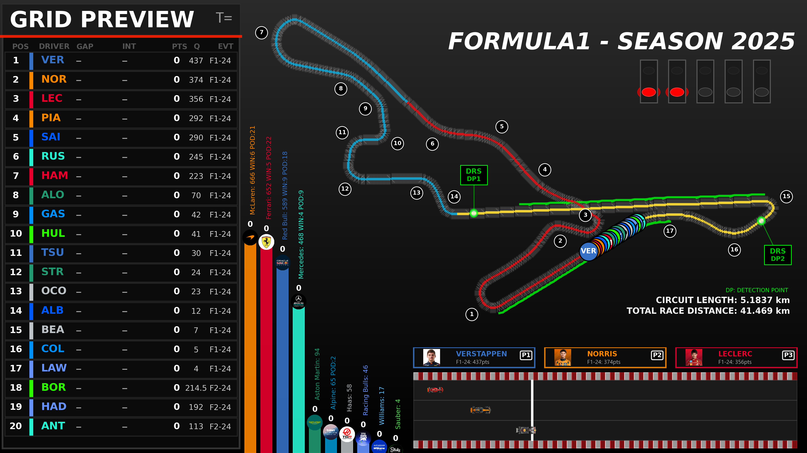
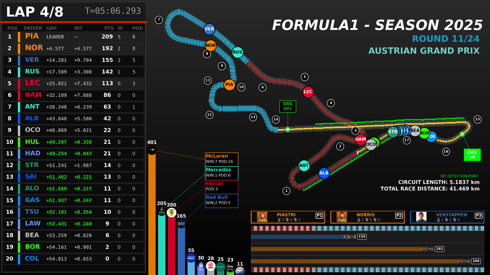
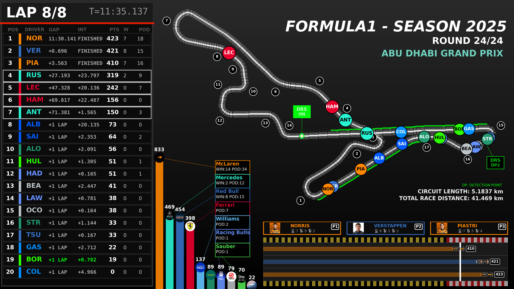

# 🏁 F1DASH
What If the F1 2025 Season Was One Race?
A Python-based motorsport simulation & visual analytics project that reimagines an entire Formula 1 championship season as a single continuous race.
Instead of replaying a Grand Prix, this system transforms 24 rounds of cumulative championship points into:
- ✔ Continuous race gaps
- ✔ Dynamic track positions
- ✔ Overtake behaviour
- ✔ DRS activation logic
- ✔ Broadcast-style race visuals

---

## Formula 1 Race Simulation & Visual Analytics System

A Python-based motorsport analytics and visualization project integrating mathematical race modeling, FastF1 telemetry analysis, track geometry reconstruction, and broadcast-style rendering.

---

## 🎬 Visual Preview

| Pre-Race Grid | Live Race Broadcast | Post-Race Results |
|:-------------:|:------------------:|:-----------------:|
|  |  |  |

---

## 📌 Project Overview

This system recreates a complete Formula 1 race environment by combining data modeling, physics-inspired logic, telemetry processing, and visual analytics. The pipeline transforms championship standings and circuit characteristics into a spatially-accurate race simulation with broadcast-quality visualization.

**Core Capabilities:**
- Statistical circuit modeling from 24 F1 tracks
- Telemetry-driven sector performance analysis
- Computer vision-based track geometry extraction
- Championship-to-distance race simulation
- DRS detection and eligibility modeling
- Broadcast-style animated rendering with live leaderboards

---

## 🚀 Key Features

### 🧠 Analytics & Simulation
- ✅ Derived reference circuit from statistical track properties
- ✅ Sector speed analytics using FastF1 telemetry
- ✅ Championship points-based race distance modeling
- ✅ Driver gap and interval simulation with realistic constraints
- ✅ Race timeline interpolation for smooth animation
- ✅ DRS detection zones and gap-based eligibility logic

### 🎨 Visualization & Rendering
- ✅ Computer vision track centerline extraction
- ✅ Geometry-based waypoint mapping for driver positioning
- ✅ Animated leaderboard with gaps and intervals
- ✅ Constructor standings animation
- ✅ Multi-panel broadcast UI with track map and sectors
- ✅ 4K frame rendering with FFmpeg export

---

## 🧠 System Architecture

### **1️⃣ Circuit Analysis**  
`01_circuit_analysis.py`

Aggregates statistical properties from 24 official F1 circuits to create a derived reference track.

**Metrics Computed:**
- Corners per km (track complexity)
- Right-turn bias (directionality)
- DRS zones per km (overtaking potential)
- Lap time per km (speed characteristic)

**Output:** Reference circuit parameters and similarity rankings

**Technical Approach:** Statistical synthesis of real circuits → theoretical reference model

---

### **2️⃣ Sector Analysis (Telemetry-Driven)**  
`02_sector_analysis.py`

Loads fastest lap telemetry via FastF1 and computes sector-specific performance metrics.

**Analysis:**
- Sector distance calculation
- Sector time extraction
- Sector average speed computation

**Output:** `sector_statistics.csv`

**Technical Approach:** FastF1 telemetry → sector performance analytics

---

### **3️⃣ Track Centerline Extraction**  
`03_track_analysis.py`

Uses computer vision to extract track geometry from circuit images.

**Process:**
- Binary thresholding and morphological operations
- Skeletonization to 1-pixel centerline
- Contour detection and validation

**Output:** `track_skeleton.png`

**Technical Approach:** OpenCV + scikit-image → track geometry reconstruction

---

### **4️⃣ Race Distance Simulation**  
`04_race_analysis.py`

**Core race modeling engine** that transforms championship standings into spatial race positioning.

**Implementation:**
- Round-based distance progression system
- Championship points normalization
- Gap scaling relative to race leader
- Minimum separation enforcement
- Sector-aware distance distribution

**Output:** `f1_race.csv` (20 drivers × 30 rounds)

**Technical Approach:** Championship dynamics → spatial race evolution model with realistic gap constraints

**Key Innovation:** Converts discrete championship points into continuous spatial positioning while maintaining race realism through minimum gaps and sector-based distance allocation.

---

### **5️⃣ Waypoints & Geometry Mapping**  
`05_waypoints_analysis.py`

Converts track centerline into ordered animation waypoints.

**Process:**
- Centerline coordinate extraction
- Path ordering and continuity validation
- Cumulative distance computation
- Pixel-to-kilometer mapping

**Output:** `track_waypoints.csv`

**Technical Approach:** Discrete geometry → animation-ready track model

---

### **6️⃣ Race Timeline Interpolation**  
`07_race_time_analysis.py`

Interpolates driver positions across animation frames for smooth motion.

**Features:**
- Frame-by-frame position interpolation
- Speed profile application from sector analysis
- Lap wrapping and finish line logic
- Overtaking detection

**Output:** `race_time_interpolated.csv`

**Technical Approach:** Discrete race rounds → continuous motion simulation

---

### **7️⃣ DRS Detection & Eligibility Logic**  
`08_drs_analysis.py`

Implements DRS (Drag Reduction System) rule logic.

**Rules Engine:**
- Detection point crossing verification
- 1-second gap eligibility check
- Lap-dependent activation (enabled after lap 2)
- Leader exclusion logic

**Output:** `drs_eligibility_log.csv`

**Technical Approach:** F1 regulations → conditional advantage modeling

---

### **8️⃣ Final Renderer**  
`10_final_rendering.py`

Broadcast-style animated visualization system with multi-panel layout.

**Components:**
- Live leaderboard with real-time gaps and intervals
- Track map with driver positioning
- Sector timing display
- Constructor standings animation
- Racing strip visualization

**Output:** 4K MP4 video via FFmpeg

**Technical Approach:** Data simulation → real-time visual analytics

---

## 📊 Data Pipeline

```
FastF1 Telemetry → Sector Analysis → Track Geometry
                                            ↓
Championship Standings → Race Simulation → Waypoint Mapping
                                            ↓
                        Timeline Interpolation + DRS Logic
                                            ↓
                        Broadcast Rendering → 4K Video
```

### Data Sources

**External API:**
- FastF1 → telemetry and race data

**Generated Datasets:**
- `f1_race.csv` – race distance simulation
- `track_waypoints.csv` – geometry mapping
- `race_time_interpolated.csv` – frame-by-frame positioning
- `drs_eligibility_log.csv` – DRS status tracking
- `sector_statistics.csv` – sector performance metrics

---

## 🛠 Technology Stack

| Domain | Tools |
|--------|-------|
| Core Language | Python 3.x |
| Data Processing | NumPy, Pandas |
| Telemetry API | FastF1 |
| Visualization | Matplotlib |
| Computer Vision | OpenCV, scikit-image |
| Image Processing | Pillow (PIL) |
| Video Encoding | FFmpeg |

---

## 🎯 Project Outputs

- ✔ Statistically derived reference circuit from 24 F1 tracks
- ✔ Sector-level speed and distance analytics
- ✔ Computer vision-based track geometry reconstruction
- ✔ Championship-to-distance race simulation model
- ✔ Realistic gap and interval dynamics
- ✔ DRS eligibility tracking system
- ✔ 4K broadcast-quality race animation

---

## 🚦 Getting Started

### Prerequisites

- Python 3.8+
- FFmpeg (for video export)

### Installation

```bash
pip install fastf1 numpy pandas matplotlib opencv-python scikit-image pillow
```

### Running the Pipeline

Execute scripts in sequence:

```bash
# 1. Analyze circuit characteristics
python 01_circuit_analysis.py

# 2. Extract sector performance metrics
python 02_sector_analysis.py

# 3. Generate track geometry
python 03_track_analysis.py

# 4. Simulate race distances
python 04_race_analysis.py

# 5. Create waypoint mapping
python 05_waypoints_analysis.py

# 6. Interpolate race timeline
python 07_race_time_analysis.py

# 7. Compute DRS eligibility
python 08_drs_analysis.py

# 8. Render final visualization
python 10_final_rendering.py
```

---

## 🗂 Project Structure

```
├── 01_circuit_analysis.py          # Statistical circuit modeling
├── 02_sector_analysis.py           # Telemetry-driven sector analysis
├── 03_track_analysis.py            # Track geometry extraction
├── 04_race_analysis.py             # Core race simulation engine
├── 05_waypoints_analysis.py        # Waypoint mapping
├── 07_race_time_analysis.py        # Timeline interpolation
├── 08_drs_analysis.py              # DRS eligibility logic
├── 10_final_rendering.py           # Broadcast visualization
├── preview/                        # Visual assets
│   ├── pre_race.png
│   ├── race.png
│   └── post_race.png
├── output/                         # Generated data files
└── README.md
```

---

## 📈 Technical Highlights

### Race Simulation Engine (`04_race_analysis.py`)

The core modeling system implements:

1. **Distance Progression**: Round-based unlocking of track distance
2. **Points Normalization**: Championship points → race positioning
3. **Gap Scaling**: Leader-relative distance computation
4. **Minimum Separation**: Realistic inter-driver spacing
5. **Sector Distribution**: Distance allocation across track sectors

This approach balances championship fidelity with race realism, creating believable spatial dynamics from discrete points standings.

### Computer Vision Pipeline (`03_track_analysis.py`)

Track geometry extraction uses:
- Adaptive thresholding for circuit boundary detection
- Morphological operations for noise reduction
- Skeletonization for centerline extraction
- Contour analysis for path validation

### Telemetry Integration (`02_sector_analysis.py`)

FastF1 integration provides:
- Microsecond-resolution GPS data
- Speed, throttle, and brake telemetry
- Sector timing markers
- Track-specific characteristics

---

## 🔬 Use Cases

- **Motorsport Analytics**: Understanding race dynamics and track characteristics
- **Data Visualization**: Broadcast-style presentation of temporal data
- **Simulation Modeling**: Championship standings to spatial positioning
- **Computer Vision**: Track geometry extraction from imagery
- **Educational**: F1 race mechanics and data science techniques

---

## 📄 License

This project is intended for educational and research purposes.

---

## 🙏 Acknowledgements

- [FastF1](https://github.com/theOehrly/Fast-F1) – Excellent F1 telemetry API
- Formula 1 – Circuit data and race structures
- Scientific Python ecosystem – NumPy, Pandas, Matplotlib, OpenCV

---

## 📧 Contact

For questions or collaboration opportunities, please open an issue or reach out via GitHub.

---

**Built for Motorsport Analytics & Simulation** 🏎️💨
